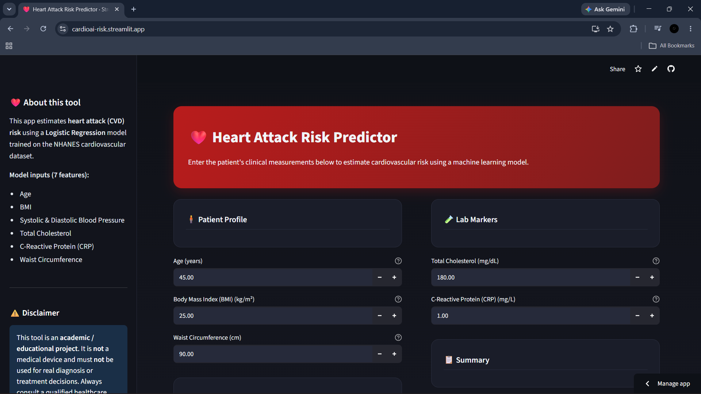
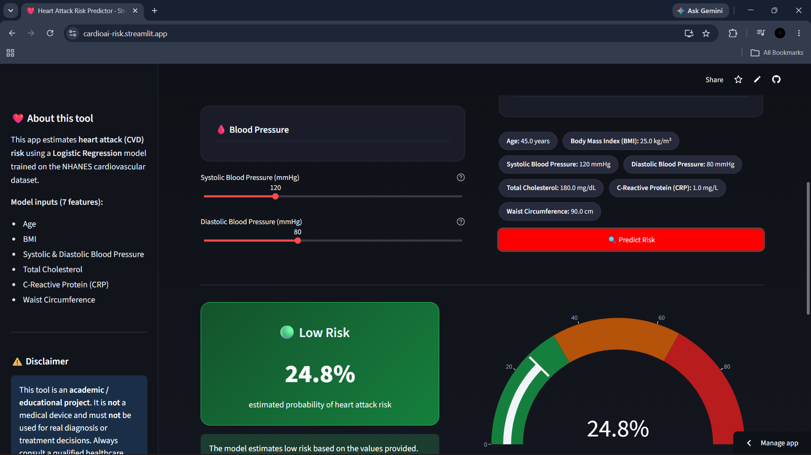

# 🫀 CardioAI - Heart Attack Risk Predictor

A machine learning powered cardiovascular risk prediction web application built with **Streamlit**.  
CardioAI estimates heart attack risk probability based on patient health measurements using a trained **Logistic Regression model**.

The project demonstrates the complete machine learning workflow, from data preprocessing and model development to deployment as an interactive web application.

---

# 🚀 Live Demo

🌐 Streamlit Application:

https://cardioai-risk.streamlit.app/

---

# 📌 Project Overview

CardioAI is an educational AI-based health risk prediction system that analyzes important cardiovascular health indicators and provides an estimated risk probability.

The application provides:

- Patient health input interface
- Heart attack risk prediction
- Risk classification (Low / Moderate / High)
- Probability visualization
- Feature contribution analysis
- Interactive medical dashboard

⚠️ **Disclaimer:**  
This application is developed for educational and academic purposes only. It is not a medical device and should not be used for real diagnosis or treatment decisions.

---

# 🖥️ Application Screenshots

## Main Dashboard

## Risk Prediction Result

---

# 🧠 Machine Learning Workflow

The project follows a complete machine learning pipeline:

Data Collection
↓
Data Cleaning
↓
Exploratory Data Analysis (EDA)
↓
Feature Selection
↓
Data Preprocessing
↓
Model Training
↓
Model Evaluation
↓
Streamlit Deployment

---

# 📊 Dataset

Dataset used:

**NHANES Cardiovascular Health Dataset**

The dataset contains demographic, physical examination, and laboratory measurements related to cardiovascular health.

---

# 🔍 Input Features

The model uses the following patient features:

| Feature | Description |
|---|---|
| Age | Patient age |
| BMI | Body Mass Index |
| Systolic Blood Pressure | Upper blood pressure value |
| Diastolic Blood Pressure | Lower blood pressure value |
| Total Cholesterol | Blood cholesterol level |
| C-Reactive Protein | Inflammation marker |
| Waist Circumference | Abdominal measurement |

---

# 🤖 Machine Learning Model

## Final Model

**Algorithm:**
- Logistic Regression

Why Logistic Regression?

- Suitable for binary classification problems
- Provides probability-based predictions
- Allows model interpretability through feature coefficients

---

# 📈 Model Evaluation

The model was evaluated using:

- Accuracy
- Precision
- Recall
- F1-score
- Confusion Matrix

Special attention was given to:

- Recall performance
- Class imbalance handling
- Risk identification capability

---

# 🛠️ Technologies Used

## Programming Language

- Python

## Machine Learning

- Scikit-learn
- NumPy
- Pandas
- Joblib

## Visualization

- Plotly

## Web Application

- Streamlit

## Deployment

- GitHub
- Streamlit Community Cloud

---

# 📂 Project Structure

CardioAI/
│
├── app.py
├── requirements.txt
├── README.md
│
├── models/
│ ├── heart_attack_model.pkl
│ └── feature_names.pkl
│
└── screenshots/
├── dashboard.png
└── report.png

---

# ⚙️ Installation and Running Locally

## 1. Clone Repository

https://github.com/muhammad-habeeb/CardioAI

## 2. Navigate to Project Folder

cd CardioAI

##3. Install Dependencies

pip install -r requirements.txt

##4. Run Streamlit Application

streamlit run app.py

The application will open in your browser:

http://localhost:8501

📦 Requirements

Main libraries:

streamlit-
pandas-
numpy-
scikit-learn-
joblib-
plotly

🎯 Future Improvements

Possible future enhancements:

Model comparison dashboard-
SHAP-based explainability-
Patient history storage-
User authentication-
Cloud database integration-
Improved clinical risk recommendations

👨‍💻 Author

Muhammad Habeeb

B.Sc Computer Science Project

📜 License

This project is created for educational purposes.
